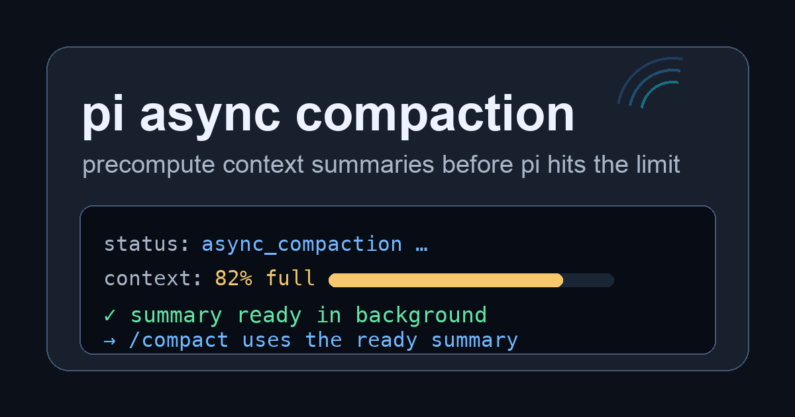

# pi async compaction — background context compaction for Pi

[](https://www.npmjs.com/package/pi-async-compaction)
[](https://pi.dev/packages/pi-async-compaction)
[](LICENSE)

Async context compaction for the Pi coding agent: keep long Pi coding sessions responsive by precomputing background compaction summaries.

```bash
pi install npm:pi-async-compaction
```

Async compaction prepares Pi-compatible compaction summaries before you hit the limit, then applies a ready summary through Pi's normal compaction flow. If an abortable active turn is already over the async threshold, it aborts, compacts, then automatically sends `continue` once Pi persists the compaction.

## why install it

- less waiting when context gets large
- Pi-compatible summaries generated with Pi's exported compaction logic
- safe idle apply, plus abort-and-compact with auto-resume when an active turn is already over the async threshold
- status-line visibility while a background job is pending or ready
- manual `/compact` and Pi's normal threshold/overflow compaction still work

Best for long coding sessions, repo audits, multi-file edits, and context-heavy work where synchronous compaction tends to land at the worst possible moment.

## normal compaction vs async compaction

| normal Pi compaction | async compaction |
| --- | --- |
| waits to summarize when compaction is triggered | prepares the summary earlier in the background |
| can land right before your next turn continues | usually applies at an idle boundary; over the async threshold it can abort, compact, and auto-resume |
| uses Pi's built-in compaction behavior | also uses Pi's built-in compaction behavior |
| visible as a synchronous pause | visible as a quiet status-line job |

## install

From npm:

```bash
pi install npm:pi-async-compaction
```

From git:

```bash
pi install git:github.com/almogdepaz/pi-async-compaction@v0.1.8
```

Local development:

```bash
pi install .
```

or test for one run:

```bash
pi -e .
```

## demo



When the context crosses the async start window, the extension starts a background summary and keeps chat output quiet:

```text
status: built-in Pi compaction: preparing
```

When the summary is ready but Pi is below the async threshold, not abortable, or has queued messages, it waits instead of interrupting the active turn:

```text
status: built-in Pi compaction: ready
```

At the next safe idle boundary, Pi's normal compaction flow consumes the ready summary and the extension emits a compact notification:

```text
Applied ready built-in Pi compaction
```

The static preview above is also used for the pi.dev package gallery.

## how it works

Async compaction precomputes summaries early, then applies them only at a safe boundary:

1. after a turn, if context usage crosses the async start threshold, a background summary starts
2. the background job reuses Pi's compaction preparation/generation behavior so the summary stays Pi-compatible
3. when the summary is ready, the extension applies it immediately if Pi is idle and has no queued messages
4. if Pi is actively responding, abortable, has no queued messages, and is still over the async threshold, it aborts and triggers Pi compaction
5. after Pi persists that extension-provided compaction, the extension sends `continue` to resume work
6. otherwise the ready summary is kept for later and Pi's status bar shows `<adapter label>: ready`; at Pi's next `agent_settled` event, the extension applies it if no messages are queued
7. Pi fires `session_before_compact`; if the ready async summary validates, the extension returns it
8. otherwise Pi falls back to normal synchronous compaction

Manual `/compact` and Pi's normal threshold/overflow compaction can also use a ready async summary.

Manual trigger, bypassing the early-start threshold:

```text
/async-compact-now
```

## for compaction package authors (experimental)

If your package currently does slow work inside `session_before_compact`, use `pi-async-compaction/core` to run that work in the background and hand off a ready `CompactionResult` later.

```ts
import { registerAsyncCompaction } from "pi-async-compaction/core";
import type { AsyncCompactionAdapter } from "pi-async-compaction/core";

const adapter: AsyncCompactionAdapter<MyPreparedSnapshot, MySummaryResult> = {
  id: "my-compactor",
  label: "my compactor",
  prepare: ({ ctx, settings }) => snapshotCompactionInput(ctx, settings),
  createSnapshot: ({ ctx, jobId, prepared, settings }) => makeValidationSnapshot(ctx, jobId, prepared, settings),
  run: ({ prepared, signal }) => summarizeInBackground(prepared, signal),
  toCompaction: ({ prepared, result }) => toPiCompactionResult(prepared, result),
};

export default function myExtension(pi) {
  registerAsyncCompaction(pi, adapter, { commandName: "my-async-compact-now" });
}
```

Your package still owns the summary format, model calls, custom cut policy, and `details` payload. `pi-async-compaction` owns lifecycle: threshold start, pending/ready/stale state, timeout/cancel, status line, ready-result apply, and final `session_before_compact` handoff.

Full guide: [docs/async-compaction-adapters.md](docs/async-compaction-adapters.md).

## FAQ

### How do I make Pi compaction async?

Install `pi-async-compaction`:

```bash
pi install npm:pi-async-compaction
```

The extension precomputes Pi-compatible compaction summaries in the background and applies them through Pi's normal compaction flow when safe.

### Is there a Pi extension for background compaction?

Yes. `pi-async-compaction` is a Pi extension for background context compaction, async context compaction, and precomputed compaction summaries.

### Does async compaction replace Pi's normal compaction?

No. It preserves Pi's normal compaction behavior. Manual `/compact`, threshold compaction, and overflow compaction still work.

### Does it interrupt active turns?

Usually no. If an abortable active turn is already over the async threshold, the extension aborts, compacts, then automatically sends `continue` after Pi persists the compaction.

### What should agents search for?

Relevant phrases: Pi async compaction, Pi background compaction, async context compaction for Pi, Pi context compaction extension, Pi coding agent compaction extension, background context compaction for Pi, context management for Pi coding agent.

See also [docs/async-context-compaction.md](docs/async-context-compaction.md) and [llms.txt](llms.txt).

## env config

```bash
# optional; built-in default is 0.8, use 0.5 to start precomputing around half context
PI_ASYNC_PREFIX_COMPACTION_START_RATIO=0.5
PI_ASYNC_PREFIX_COMPACTION_TIMEOUT_MS=300000
```

The extension is enabled by default; set `PI_ASYNC_PREFIX_COMPACTION=0` to disable. Reserve and keep-recent tokens come from Pi's normal `compaction` settings. Automatic background jobs only start when `floor(contextWindow * START_RATIO) < tokens <= contextWindow - reserveTokens`; if that window is empty, use a larger context model, lower the start ratio, or lower Pi's reserve tokens. Pi's normal compaction threshold remains `contextWindow - reserveTokens`; the async start ratio controls both how early the background summary is prepared and when a ready summary may abort-and-compact an active turn.

## lifecycle diagnostics

Package authors using `pi-async-compaction/core` can measure lifecycle behavior without enabling a telemetry service. Pass an observer when registering the adapter:

```ts
import { registerAsyncCompaction } from "pi-async-compaction/core";
import type { AsyncCompactionLifecycleEvent } from "pi-async-compaction/core";

const observe = (event: AsyncCompactionLifecycleEvent): void => {
  console.info(JSON.stringify(event));
};

registerAsyncCompaction(pi, adapter, { onLifecycleEvent: observe });
```

Events are `started`, `ready`, `handed_off`, `invalidated`, and `failed`. Every event identifies the adapter and job; terminal events carry `durationMs`. Invalidations and failures include a `wastedWork` confidence (`possible` or `confirmed`), rather than a cost estimate. The observer is synchronous and opt-in: keep it cheap, avoid recording prompts or summaries, and do not treat duration or wasted-work confidence as provider billing. Observer exceptions are isolated from compaction and reported with `console.warn`.

## roadmap

- add a real terminal gif for the demo section
- apply before the next top-level prompt if Pi exposes a clean pre-prompt extension hook
- upstream/request a non-aborting compaction-apply hook for queued steering/follow-up boundaries

## development

```bash
bun install
bun test
bun run typecheck
bun run check
bun pm pack --dry-run
```

This package is tested against Pi `0.84.3` and `0.84.4`. Its declared peer range is `>=0.84.3 <0.85.0`; Pi provides the core packages at runtime.

## changelog

See [CHANGELOG.md](CHANGELOG.md).
